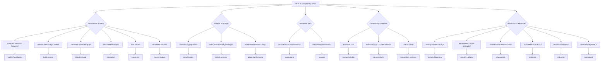

# Zephyr Skill Selection Decision Tree

Use this tree to determine which consolidated skill to use for your current task.

```mermaid
graph TD
    Start[What is your primary task?] --> Foundations{Foundations & Setup}
    Start --> Kernel{Kernel & App Logic}
    Start --> Hardware{Hardware & I/O}
    Start --> Connectivity{Connectivity & Network}
    Start --> Production{Production & Advanced}

    Foundations --> F1[Common Macros/C Patterns?] --> S_Foundations[zephyr-foundations]
    Foundations --> F2[West/Build/Kconfig/CMake?] --> S_Build[build-system]
    Foundations --> F3[Hardware Model/Bringup?] --> S_Bringup[board-bringup]
    Foundations --> F4[Devicetree/Overlays?] --> S_DT[devicetree]
    Foundations --> F5[Simulation?] --> S_Native[native-sim]
    Foundations --> F6[Out-of-tree Module?] --> S_Module[zephyr-module]

    Kernel --> K1[Threads/Logging/Shell?] --> S_KBasics[kernel-basics]
    Kernel --> K2[SMF/Zbus/Work/IRQ/Settings?] --> S_KServices[kernel-services]
    Kernel --> K3[Power/Performance tuning?] --> S_PM[power-performance]

    Hardware --> H1[GPIO/ADC/I2C/SPI/Sensors?] --> S_HWIO[hardware-io]
    Hardware --> H2[Flash/Filesystems/NVS?] --> S_Storage[storage]

    Connectivity --> C1[Bluetooth LE?] --> S_BLE[connectivity-ble]
    Connectivity --> C2[IP/Socket/MQTT/CoAP/LwM2M?] --> S_IP[connectivity-ip]
    Connectivity --> C3[USB or CAN?] --> S_USBCAN[connectivity-usb-can]

    Production --> P1[Testing/Twister/Tracing?] --> S_Test[testing-debugging]
    Production --> P2[Bootloader/OTA/TF-M/Crypto?] --> S_Security[security-updates]
    Production --> P3[Thread/Golioth/Matter/LoRa?] --> S_IoT[iot-protocols]
    Production --> P4[SMP/AMP/IPC/LLEXT?] --> S_Multicore[multicore]
    Production --> P5[Modbus/CANopen?] --> S_Industrial[industrial]
    Production --> P6[Audio/Display/LVGL?] --> S_Specialized[specialized]
```
